# Smart Campus Management Platform

<p align="center">
  <picture>
    <source media="(prefers-color-scheme: dark)" srcset="public/logo-white.png" />
    
  </picture>
</p>

<p align="center">
  <b>English</b> · <a href="README.hinglish.md">हिंग्लिश</a>
</p>

One platform for everything on campus — attendance, assignments, events, placements, notifications. Dedicated dashboards for students, faculty, coordinators and admins.

Built for **DevFusion 4.0: The Developers Hackathon**.

## ⭐ Standout Features

These are the most unique capabilities of the platform:

- **🪪 Face Recognition Attendance** — check in with camera or photo upload. **Anti-spoofing liveness detection** (MiniFASNet) rejects printed photos and phone screens; UniFace (SCRFD + ArcFace) handles detection and identity matching. Face enrollment + token-based QR check-in.
- **🤖 AI Campus Assistant** — RAG chatbot grounded in IIT Bombay campus knowledge with cited sources, plus normal chit-chat. Per-user AI settings (bring your own Gemini/DeepSeek key).
- **📷 QR Attendance Scanner** — faculty creates a session, students scan the QR or paste the token to mark attendance instantly.
- **🎙️ AI Lecture Notes** — audio/voice transcription + summarization into structured study notes.
- **💼 AI Placement Match** — resume/job matching with match % plus feedback sentiment analysis.
- **⚡ Web Push Notifications** — real-time browser alerts (VAPID) for assignments, events, placements.

## Live App

- **Live URL:** https://iit-bombay-hackathon-1r7i.vercel.app
- Auto-deploy on `main` push (Vercel, Mumbai region)

> **Auth status:** Email + password login & sign-up **tested & working** (OTP verification via
> dev-server log or SMTP). **Google Sign-in & Sign-up also working** (login page → Continue with
> Google → consent → dashboard; new Google user auto-creates as a student).

## Screenshots

**Website home page:**


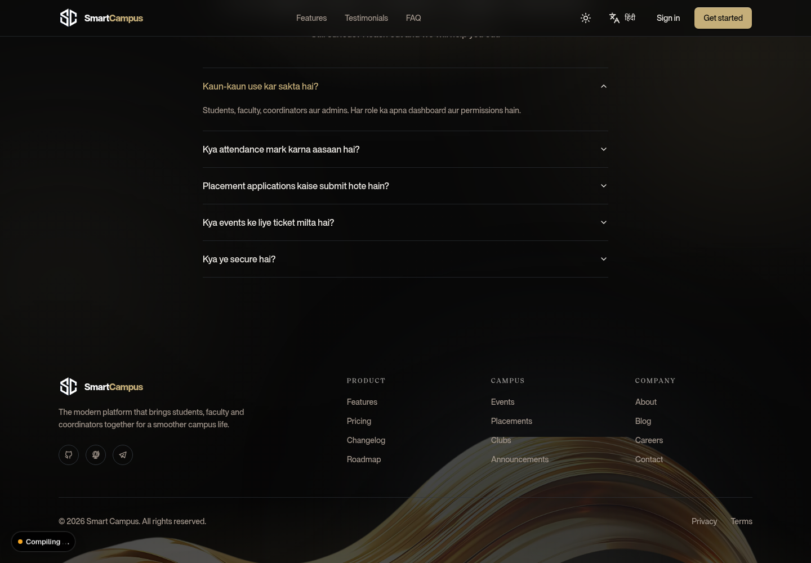

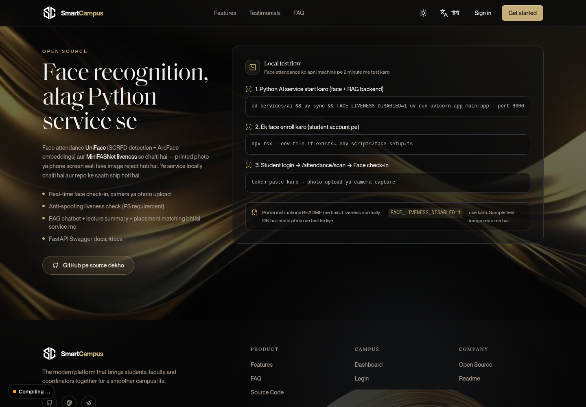

**Authentication:**

| Login (demo accounts) | |
| --------------------- | - |
|  | |

**Student portal:**

| Dashboard | Attendance | Assignments |
| --------- | ---------- | ----------- |
|  |  |  |

| Events | Placements | Clubs |
| ------ | ---------- | ----- |
|  |  | 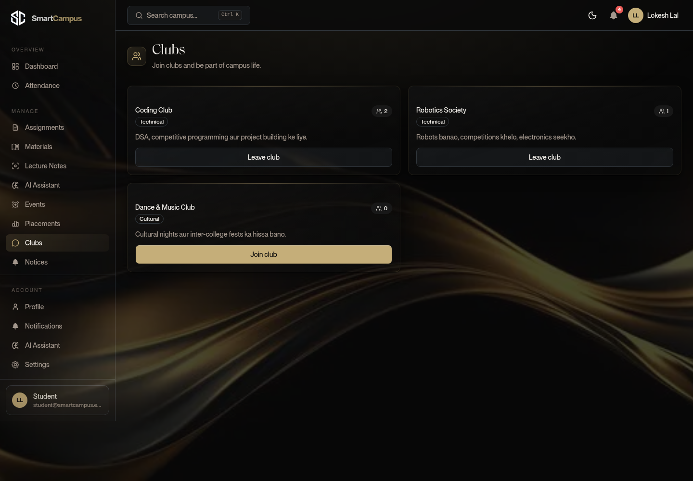 |

**Faculty portal:**

| Dashboard | Attendance | Assignments |
| --------- | ---------- | ----------- |
| 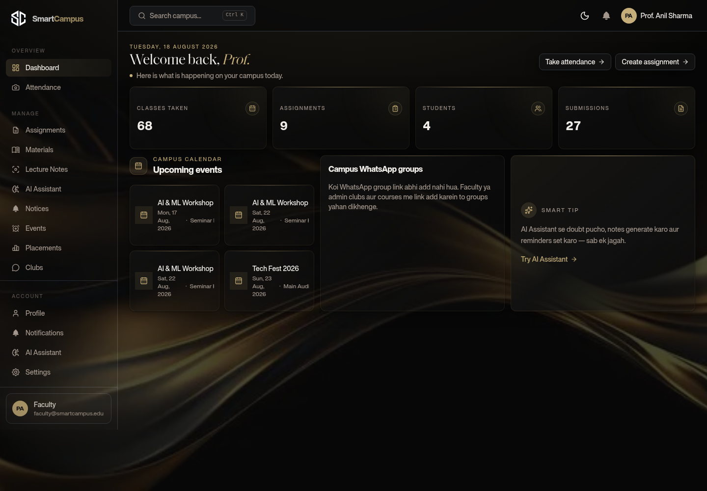 | 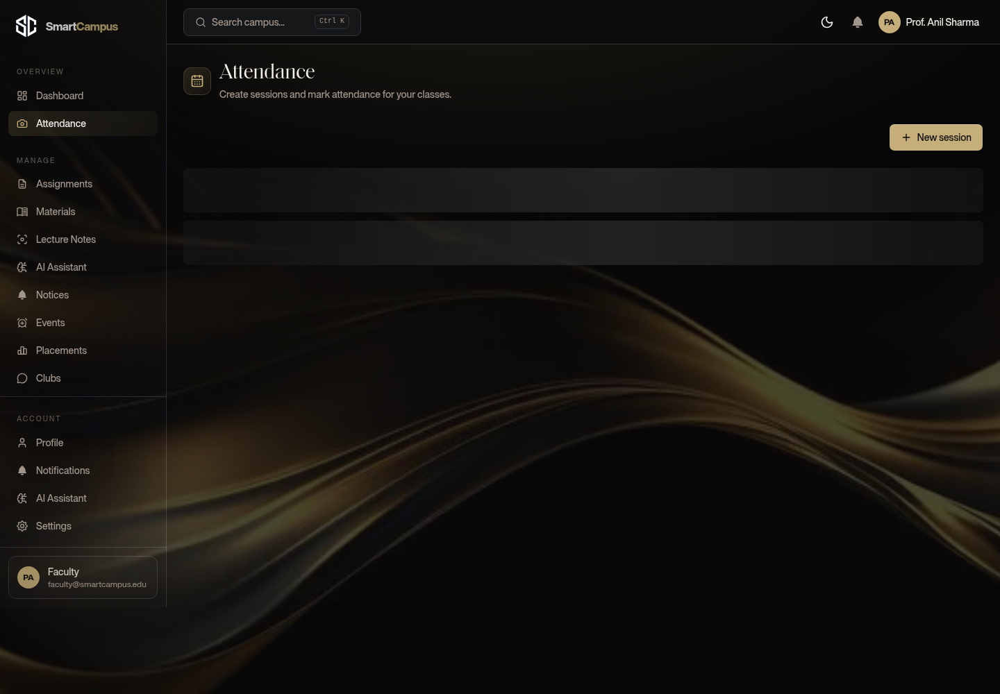 | 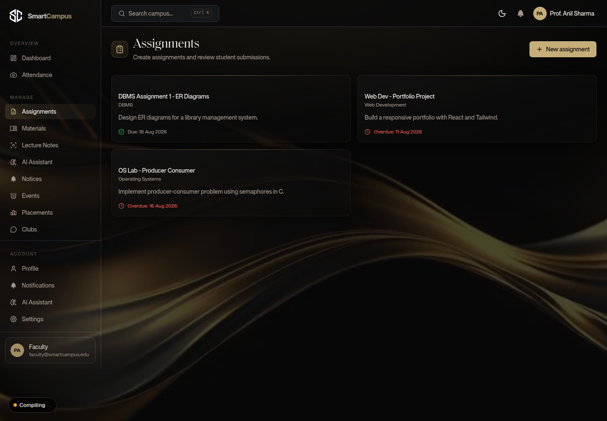 |

**Coordinator portal:**

| Dashboard | Events | Placements |
| --------- | ------ | ---------- |
| 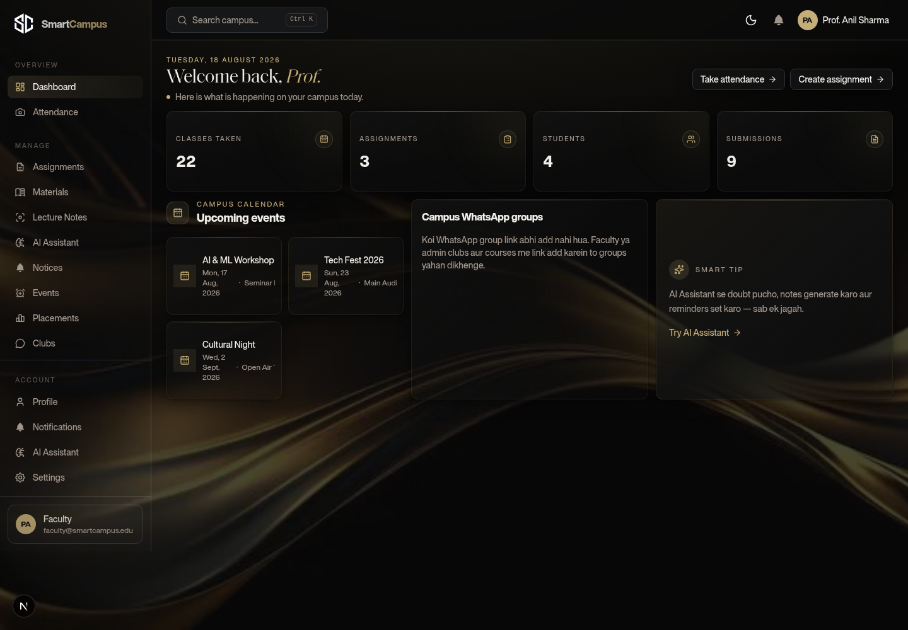 | 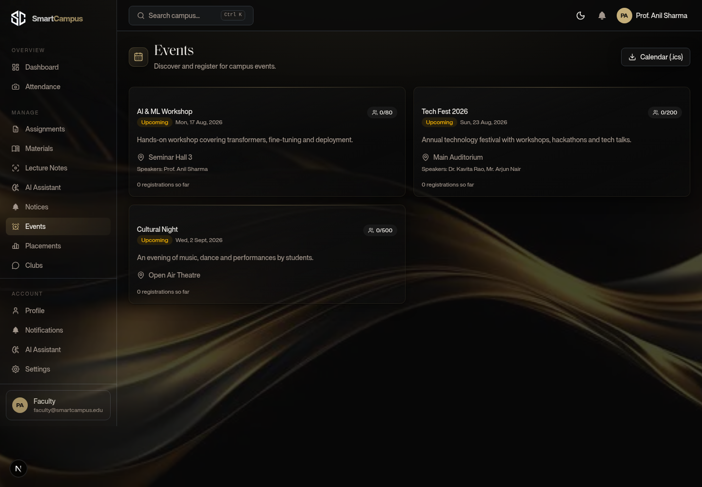 | 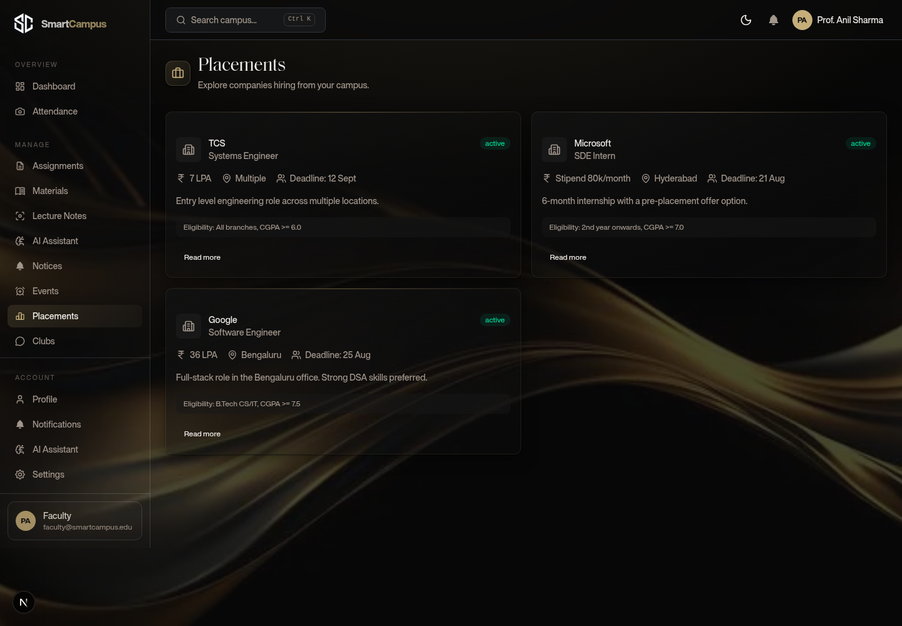 |

**Admin portal:**

| Dashboard | Users | Activity Logs |
| --------- | ----- | ------------- |
| 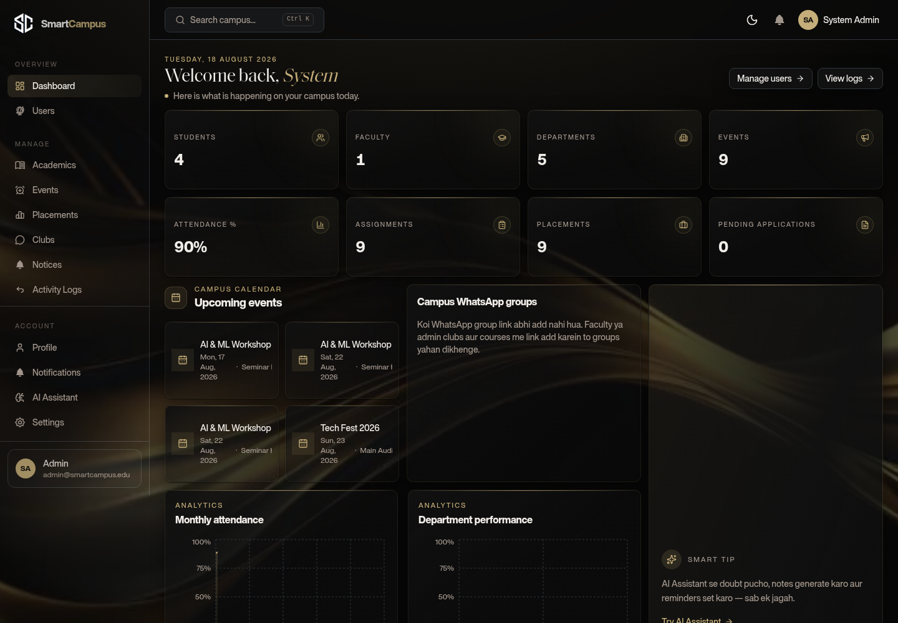 | 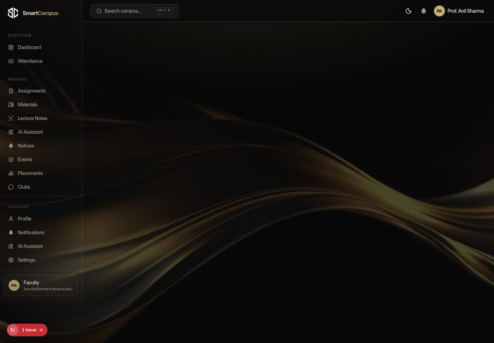 | 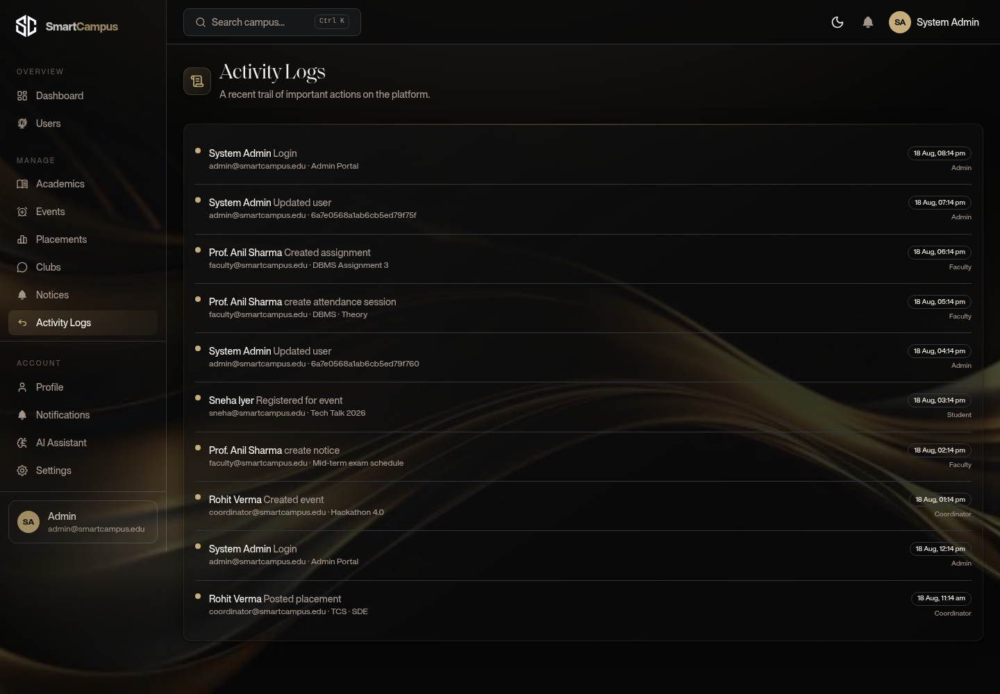 |

> More screenshots for every role (notices, materials, lecture notes, notifications, profile, settings, AI assistant, academics): see the [`public/screenshots/`](public/screenshots/) folder.

## Unique Features

- **Face Recognition Attendance** — check-in via camera or photo upload with liveness detection (printed/screen photos rejected), face enrollment + token based QR check-in
- **AI Campus Assistant** — RAG chatbot giving grounded answers to IIT Bombay campus FAQs (with sources), greetings + normal chit-chat, per-user AI settings
- **QR Attendance Scanner** — check-in token + QR system
- **AI Lecture Notes** — audio/voice transcription + summarization
- **AI Placement Match** — resume/job matching + sentiment analysis
- **AI Plagiarism Detection** — similarity check on assignment submissions
- **Web Push Notifications** — browser push (VAPID) + real-time alerts
- **QR Event Passes** — QR pass download on event registration
- **Smart Analytics Dashboards** — attendance %, department performance, placement stats, charts
- **Global Search** — students, faculty, events, assignments, placements in one search
- **OTP Email Verification + Forgot Password** — secure signup/recovery flow
- **Dark/Light Mode + Smooth Animations** — Framer Motion + shadcn/ui
- **Admin Audit Logs** — sensitive admin actions logged

## Design System

Golden-on-black premium aesthetic (dulcedo.com-inspired editorial style):

- **Brand colors** — gold `#C5AE79` accent, deep black backgrounds, warm off-white surfaces
- **Typography** — serif display headings (editorial feel) + clean sans body, tabular numerals for stats
- **Glassmorphism** — glass stat cards with gold gradient borders, hairline highlights, subtle glow
- **Dashboard** — consistent premium layout for every role: gold stat cards, editorial calendar widget, campus WhatsApp groups, smart tip card; sidebar icons animate on hover; viewport-fit compact layout (no scrolling needed). Admins also get full analytics charts (attendance trend, department performance, placement stats, top events) — all in the gold theme.
- **Landing** — stacked serif hero, label + number stat pairs, gold wave imagery, gold-themed scrollbar
- **Motion** — staggered card entrances, hover lift + glow, icon micro-animations

Full dashboard design reference: [`DASHBOARD_DESIGN.md`](DASHBOARD_DESIGN.md)

## Tech Stack

- **Frontend:** Next.js 16, React 19, Tailwind CSS, shadcn/ui, Framer Motion
- **Backend:** Next.js API routes, MongoDB (Mongoose)
- **Auth:** NextAuth v5 — Email + OTP, Google OAuth, JWT sessions
- **Extras:** QR event passes, email via SMTP, activity logs, dark/light mode, Python AI service (FastAPI)

## All Features

**Authentication & Security**
- Email + password signup/login with OTP email verification
- Google OAuth login/signup (auto user creation)
- Forgot password via OTP + email verification
- JWT session auth, secure cookies, protected routes
- bcrypt password hashing, input validation, rate limiting
- Role-based access (Student / Faculty / Coordinator / Admin)
- Admin audit logging for sensitive actions

**Student Portal**
- Dashboard — attendance %, assignment deadlines, upcoming events
- Attendance — subject-wise percentage, history, monthly reports
- Assignments — submit solution (file / GitHub link), late submission status
- Events — register, cancel, view ticket, download QR pass
- Placements — company listings, apply with resume, application status
- Clubs — join/leave memberships
- Notifications — real-time with unread badge
- Profile — picture, phone, roll number, department, semester, skills, LinkedIn, GitHub, resume, bio

**Faculty Portal**
- Create assignments (deadline, attachments, rubric)
- Take attendance — create session, mark present/absent
- Review submissions, grade with marks + feedback
- Plagiarism check on submissions
- Publish notices, upload study material

**Coordinator Portal**
- Manage events (banner, venue, deadline, seats, speakers)
- Manage placements (company, role, eligibility, CTC, deadline)
- Manage clubs, announcements

**Admin Portal**
- User management — list, change role/status, delete
- Departments + courses management
- Analytics — students, faculty, events, attendance %, assignment stats, placement statistics, charts
- Activity logs, announcements, reports

**Notifications**
- Real-time — assignment due, attendance marked, event reminder, placement open, system alerts

**Analytics**
- Monthly attendance, department performance, assignment completion, placement statistics, event participation

**Settings**
- Profile, change password, theme (dark/light), notification preferences, connected accounts, delete account

**AI Features**
- RAG campus chatbot (IIT Bombay context, with sources)
- Lecture transcription + summarization
- Placement matching + sentiment analysis
- Plagiarism detection
- Per-user AI credentials (Settings → AI)

**Platform**
- Global search, QR event passes, QR attendance, face recognition, push notifications
- Responsive mobile-first UI, dark/light mode, loading skeletons, empty states, toasts, Framer Motion animations
- Dockerized deployment, CI/CD (Vercel auto-deploy), API docs (Swagger)

## Quick Start

You'll need:

- Node.js 18.18+ (20+ recommended)
- MongoDB — local or [MongoDB Atlas](https://www.mongodb.com/atlas) (free tier is enough)

```bash
# 1. Clone the repo
git clone https://github.com/AnonymousCoderArtist/IIT-Bombay-Hackathon.git
cd IIT-Bombay-Hackathon

# 2. Install dependencies
npm install

# 3. Environment setup
cp .env.example .env
# Add MONGODB_URI to .env (and AUTH_SECRET - generate with `openssl rand -base64 32`)

# 4. Seed the database (sample data + test users)
npm run seed

# 5. Run the dev server
npm run dev
```

Open [http://localhost:3000](http://localhost:3000).

### AI features (optional — chatbot, lecture notes, face recognition)

The Python AI service (`services/ai/`) powers the RAG chatbot, lecture summarization, placement
match, sentiment analysis and **face recognition attendance** (UniFace + MiniFASNet liveness).
Without it the app still runs (mock fallback) — only the AI/face responses are mocked.

> Repo URL: <https://github.com/AnonymousCoderArtist/IIT-Bombay-Hackathon>

```bash
# 1. Set up the Python service (first time) — install [uv](https://docs.astral.sh/uv)
cd services/ai
cp .env.example .env   # add AI_PROVIDER + a free API key (optional)
uv sync                # installs deps from pyproject.toml + uv.lock

# 2. Run the service (port 8000)
uv run uvicorn app.main:app --port 8000

# 3. Link it in the root .env
# AI_SERVICE_URL=http://localhost:8000
```

Face-check-in models are **bundled in the repo** (`services/ai/models/`, ~29MB) — no download
needed. The service auto-uses them (SHA-256 verified, so it never re-downloads). **Liveness is ON
by default** (printed/photos rejected) — to test with static photos start with
`FACE_LIVENESS_DISABLED=1`. Full face-testing steps are in
["Face Attendance testing"](#face-attendance-testing-test-card) below.

Free LLM keys:
- **Gemini** — `AI_PROVIDER=gemini` + `GEMINI_API_KEY` ([aistudio.google.com/apikey](https://aistudio.google.com/apikey))
- **DeepSeek** — `AI_PROVIDER=deepseek` + `DEEPSEEK_API_KEY`

> All AI service endpoints are on Swagger: `http://localhost:8000/docs`

## Test Credentials

All test users below are seeded in **MongoDB Atlas (live database)** — you can log in from both the local and the deployed app.

The login page has a **Demo accounts** section — click any role to auto-fill its credentials (then just "Sign in").

| Role | Email | Password |
| ---- | ----- | -------- |
| Admin | `admin@smartcampus.edu` | `Admin@123` |
| Coordinator | `coordinator@smartcampus.edu` | `Coord@123` |
| Faculty | `faculty@smartcampus.edu` | `Faculty@123` |
| Student | `student@smartcampus.edu` | `Student@123` |

Additional sample students: `rahul@smartcampus.edu` / `Student@123`, `sneha@smartcampus.edu` / `Student@123`.

## Testing Guide

> **Full detailed step-by-step guide for every feature:** [`docs/TESTING.md`](docs/TESTING.md)

### Step 1 — Setup

```bash
# 1. Start MongoDB — no Docker/Atlas needed (local mongod)
npm run mongo:start      # data stored in ~/data/mongodb, runs in background
# (verify with: mongosh --eval "db.runCommand({ping:1})"  →  { ok: 1 })
# (to stop: npm run mongo:stop)

# 2. Dependencies + env
npm install
cp .env.example .env
# Add AUTH_SECRET to .env:  openssl rand -base64 32

# 3. Seed sample data (4 test users + departments + events + assignments etc.)
npm run seed

# 4. Dev server
npm run dev
```

Open [http://localhost:3000](http://localhost:3000).

### Step 2 — Automated checks

```bash
# Typecheck + lint (fast, run every time)
npm run check

# API sanity check (dev server must be ON)
npm run test
# Output: "Sab theek hai. App ready hai!" — means health, DB and all APIs are responding
```

### Step 3 — Manual testing (demo flow)

Log in with each role and go through this flow. Keep one tab on the app and another for API route checks.

**Login flow:**
1. Go to the register page, sign up with `name + email + password` (you'll get an OTP)
2. How to get the OTP? If there's no SMTP in `.env`, the email isn't sent — the **OTP is shown in the dev-server terminal log on the `[mail:...]` line**. Enter that 6-digit code. (Valid for 10 min)
3. Log in after verification

**Student (`student@smartcampus.edu` / `Student@123`):**
- Dashboard — attendance %, deadlines, upcoming events
- Attendance — see your subject-wise percentage
- Assignments — view the list, submit on any (content or GitHub link)
- Events — register for an event → **you get a QR pass** (download it), then you can also cancel
- Placements — view listings, apply, track status
- Clubs — join/leave a club
- Settings — toggle dark/light theme, notification toggles on/off, **refresh the page to verify everything is saved**

**Faculty (`faculty@smartcampus.edu` / `Faculty@123`):**
- Attendance — create a new session, mark students present/absent
- Assignments — create an assignment (with deadline + rubric), view submissions, grade + give feedback
- Notices — post a new notice

**Coordinator (`coordinator@smartcampus.edu` / `Coord@123`):**
- Events — create a new event (date, venue, capacity)
- Placements — post a new company opening (role, CTC, eligibility)
- Clubs — create a new club

**Admin (`admin@smartcampus.edu` / `Admin@123`):**
- Dashboard — full analytics (students, events, submissions, everything)
- Users — view list, change role/status, delete
- Activity Logs — view all activity

**Cross-cutting checks (from any role):**
- 🔍 Top search bar — type "AI", "hackathon", "club" to test global search
- 🔔 Notifications — unread count on the bell icon, mark-as-read on the notifications page
- 📱 **Mobile** — open phone view (360px) in browser devtools, hamburger menu should open the sidebar
- 🌙 Dark mode — check from both the topbar toggle and Settings
- Password change — Settings → Change Password (old password + new)
- Logout → log back in

### Face Attendance testing (test card)

Face check-in runs through `services/ai/` (UniFace + MiniFASNet liveness). Models are bundled in
the repo (`services/ai/models/`) — **no re-download or re-training on a fresh setup**; the service
verifies them via SHA-256 and uses them directly. Local test flow:

```bash
# 1. Start the AI service (port 8000) — disable liveness for testing (allows static photos)
cd services/ai
FACE_LIVENESS_DISABLED=1 .venv/bin/uvicorn app.main:app --port 8000
# (root .env must have AI_SERVICE_URL=http://localhost:8000)

# 2. Enroll a face (on the student account) — script prints student id + today's session + token
npx tsx --env-file-if-exists=.env scripts/face-setup.ts
```

3. Log in as a student in the app → `/attendance/scan` → paste the token in the **Face check-in**
   card (the token the script printed) → "Face se check-in karo" → upload a photo or capture from camera.
4. Go to `/attendance` → status should show `present`.

> Token valid for 30 min. If it expires, re-run step 2. Liveness is normally ON
> (printed/screen photos rejected); use `FACE_LIVENESS_DISABLED=1` for testing.

**Sample test image (included in the repo):** [`public/Elon Musk.jpg`](public/Elon%20Musk.jpg) —
use it for both enrollment and check-in. With `FACE_LIVENESS_DISABLED=1` you can test static-photo
check-in too. (`ElonTest.jpg` is also in the repo.)

### AI Assistant (normal chat + IIT Bombay context)

The assistant is a regular AI chatbot that talks within the IIT Bombay context — it does greetings and
general chit-chat, and campus-specific questions get grounded answers from the KB (with sources).
In mock mode (AI service without an LLM key) general answers are limited — **for better answers add
your AI credentials in Settings → AI** (Gemini/DeepSeek/OpenAI-compatible). Then the assistant runs on
a real LLM and answers well on both general and campus topics.

### Step 4 — API quick checks (curl)

```bash
# Health + DB
curl http://localhost:3000/api/health

# Public auth flow (new email)
curl -X POST http://localhost:3000/api/auth/register \
  -H "Content-Type: application/json" \
  -d '{"name":"Test User","email":"test@example.com","password":"Test@123","role":"student"}'

# Protected route without login → should return 401
curl http://localhost:3000/api/events            # → {"error":"Unauthorized"}

# Rate limit test (register 5+ times from same IP → 429)
for i in $(seq 1 6); do curl -s -o /dev/null -w "%{http_code} " \
  -X POST http://localhost:3000/api/auth/register \
  -H "Content-Type: application/json" \
  -d '{"name":"Spam","email":"spam@example.com","password":"Test@123","role":"student"}'; done
# Output: 201 201 201 201 201 429   ← 6th request rate-limited
```

### Step 5 — Demo recording tips

- For a 2-minute video: landing → register/verify → login (student) → dashboard → attendance → assignment submit → event register (QR) → placements apply → admin login → analytics + users → dark mode + mobile view
- Don't forget to show the `npm run dev` terminal with the screen recorder where the OTP logs (for the registration demo)

## PS-1 Coverage (DevFusion 4.0)

Problem Statement 1: **Smart Campus Management Platform** — production-ready, role-based campus
platform with auth, notifications, dashboards, analytics and responsive design.

**Mandatory Tech Stack:** React/Next.js ✓ · TypeScript ✓ · Tailwind CSS ✓ · Responsive UI ✓ · Node.js ✓ · Next.js API ✓ · MongoDB (Mongoose) ✓ · Email auth ✓ · Google OAuth ✓ · JWT/session auth ✓ · Vercel deployment ✓ · Docker (bonus) ✓

**Authentication:** Sign-up via email+password ✓ · Sign-up via Google ✓ · Login via email ✓ · Login via Google ✓ · Forgot password (OTP + email verification) ✓ · Email verification before dashboard access ✓ · Secure session management (JWT in cookies) ✓ · Secure logout ✓ · Protected routes (dashboard/settings/profile/events/attendance) ✓

**User Roles (4):** Student ✓ · Faculty ✓ · Coordinator ✓ · Admin ✓ — role-wise permissions implemented as per PS.

**Modules:** Student portal ✓ · Faculty portal ✓ · Event management ✓ · Attendance ✓ · Placement notices ✓ · Club activities ✓ · Assignment submission ✓ · Announcements/notices ✓ · Notifications ✓ · Admin controls ✓

**Landing Page:** Hero ✓ · Features ✓ · Testimonials ✓ · Statistics ✓ · FAQ ✓ · Footer ✓ · Responsive navigation ✓ · Dark mode ✓ · Animations ✓ · Loading screens ✓ · SEO ✓

**Dashboards:** every role gets a separate dashboard (student — attendance %, deadlines, events; faculty — classes, attendance, submissions; coordinator — events/placements/clubs; admin — full analytics + logs) ✓

**Student Profile:** picture, name, email, phone, roll number, department, semester, skills, LinkedIn, GitHub, resume upload, bio ✓

**Attendance:** faculty creates session + marks ✓ · student views %, history, subject-wise analytics, monthly reports ✓

**Assignments:** faculty uploads (deadline, attachments, rubric) ✓ · student submits (file/PDF/ZIP/GitHub link), submission history, late status ✓ · faculty review + marks + feedback ✓

**Events:** create (banner, description, venue, registration deadline, seats, speakers) ✓ · QR pass ✓ · student register/cancel + view ticket ✓

**Placements:** companies, roles, eligibility, CTC, deadline ✓ · apply button + application status + resume upload ✓

**Notifications:** real-time — assignment due, attendance marked, event reminder, placement open, system alerts ✓

**Global Search:** students, faculty, events, assignments, placements ✓

**Analytics charts:** monthly attendance, department performance, assignment completion, placement statistics, event participation ✓

**Admin Panel:** users, departments, courses, events, assignments, attendance, announcements, reports, logs, permissions ✓

**Settings:** profile, password, theme, notification preferences, connected accounts, delete account ✓

**UI/UX:** responsive design · dark/light mode · loading skeletons · empty states · error pages · toast notifications · beautiful forms · smooth animations · mobile friendly · accessibility (keyboard nav, contrast, semantic HTML) ✓

**Security:** bcrypt password hashing ✓ · input validation ✓ · rate limiting ✓ · XSS protection ✓ · secure cookies ✓ · environment variables ✓ · file upload validation ✓ · authorization middleware ✓ · server-side validation ✓ · audit logging for sensitive admin actions ✓

**Database entities (13/13):** Users ✓ · Roles ✓ · Departments ✓ · Attendance ✓ · Assignments ✓ · Assignment Submissions ✓ · Events ✓ · Event Registrations ✓ · Notifications ✓ · Placements ✓ · Applications ✓ · Settings ✓ · Activity Logs ✓

**Bonus features implemented:** AI chatbot for campus FAQs ✓ · QR attendance scanner ✓ · Face recognition attendance ✓ · Admin audit logs ✓ · API docs (AI service Swagger/OpenAPI) ✓ · Dockerized deployment ✓ · CI/CD (Vercel auto-deploy) ✓

**Bonus features not implemented:** live chat, calendar sync, PWA/offline, multi-language, AI plagiarism detection, email reminders, push notifications, WebSockets live updates, CSV/Excel export.

## Pending

- [ ] Add a free LLM key (Gemini/DeepSeek) so the chatbot + lecture notes run on real AI (not mock).
- [ ] Demo video (3–5 min)

## Deploy on Vercel

**Live:** https://iit-bombay-hackathon-1r7i.vercel.app

`vercel.json` is already present (Mumbai region `bom1`, Next.js auto-detect, auto-deploy on `main`).

1. Push the repo to GitHub → on [Vercel](https://vercel.com/new) "Import Project" → select the repo
2. Build auto-detects (`npm run build`)
3. **Project Settings → Environment Variables** — add these (same values as `.env`):

   | Variable | Value | Note |
   | -------- | ----- | ---- |
   | `MONGODB_URI` | Atlas SRV string | replace `<db_password>` with your Atlas password (localhost won't work on Vercel) |
   | `AUTH_SECRET` | from `openssl rand -base64 32` | unique per deploy |
   | `AUTH_TRUST_HOST` | `true` | required on Vercel |
   | `AUTH_URL` | **leave empty** | Vercel sets it from trustHost |
   | `GOOGLE_CLIENT_ID` | from `.env` | same |
   | `GOOGLE_CLIENT_SECRET` | from `.env` | same |
   | `AI_SERVICE_URL` | empty (mock) or a separate host | URL of a separately deployed Python AI service |
   | `SMTP_HOST` / `SMTP_PORT` / `SMTP_USER` / `SMTP_PASS` / `SMTP_FROM` | optional | for emails |
   | `GEMINI_API_KEY` + `AI_PROVIDER=gemini` | optional | real AI chatbot |

4. After deploying, add the redirect URI in the Google Cloud Console:
   `https://<vercel-domain>/api/auth/callback/google`
5. Deploy the Python AI service free on [Render](https://render.com) or Railway and set `AI_SERVICE_URL`
   (otherwise the app runs in mock mode — AI features are limited).

> Note: Vercel's serverless filesystem doesn't persist files, so resume/attachment uploads need
> Cloudinary or Vercel Blob. The Python AI service is a separate service (connected via
> `AI_SERVICE_URL`). Vercel injects env at build, so `.env` auto-loading isn't an issue.

## Environment Variables

`MONGODB_URI`, `AUTH_SECRET`, Google OAuth credentials and SMTP details — full list in `.env.example`.
Credential placement guide (what goes where) — [`docs/CREDENTIALS.md`](docs/CREDENTIALS.md).

## Deliverables (PS-1 Expected Deliverables)

| PS-1 Expected Deliverable | Status | Where |
| ------------------------- | ------ | ----- |
| Source code (GitHub) | ✅ | [github.com/AnonymousCoderArtist/IIT-Bombay-Hackathon](https://github.com/AnonymousCoderArtist/IIT-Bombay-Hackathon) |
| Live deployed application | ✅ | [https://iit-bombay-hackathon-1r7i.vercel.app](https://iit-bombay-hackathon-1r7i.vercel.app) |
| README with setup instructions | ✅ | this file |
| API documentation | ✅ | [`docs/API.md`](docs/API.md) + AI service Swagger (`http://localhost:8000/docs`) |
| Database schema / ER diagram | ✅ | [`docs/ERD.md`](docs/ERD.md) + `src/lib/models/` |
| Architecture diagram | ✅ | [`docs/ARCHITECTURE.md`](docs/ARCHITECTURE.md) |
| Test credentials | ✅ | [Test Credentials](#test-credentials) section |
| Environment variable template | ✅ | `.env.example` |
| License file | ✅ | [MIT](LICENSE) |
| Demo video (3–5 min) | ⏳ pending | — |

Full feature test guide: [`docs/TESTING.md`](docs/TESTING.md)

## License

MIT
