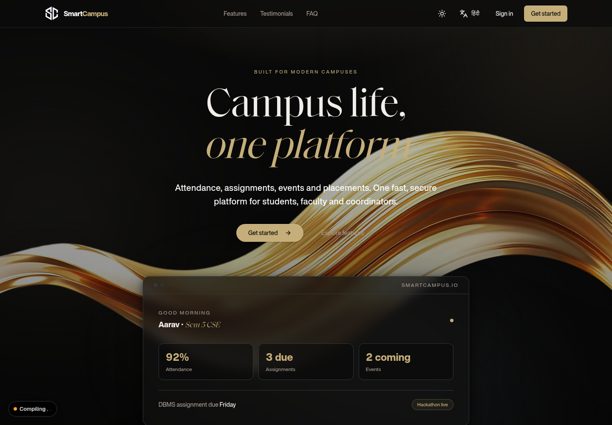
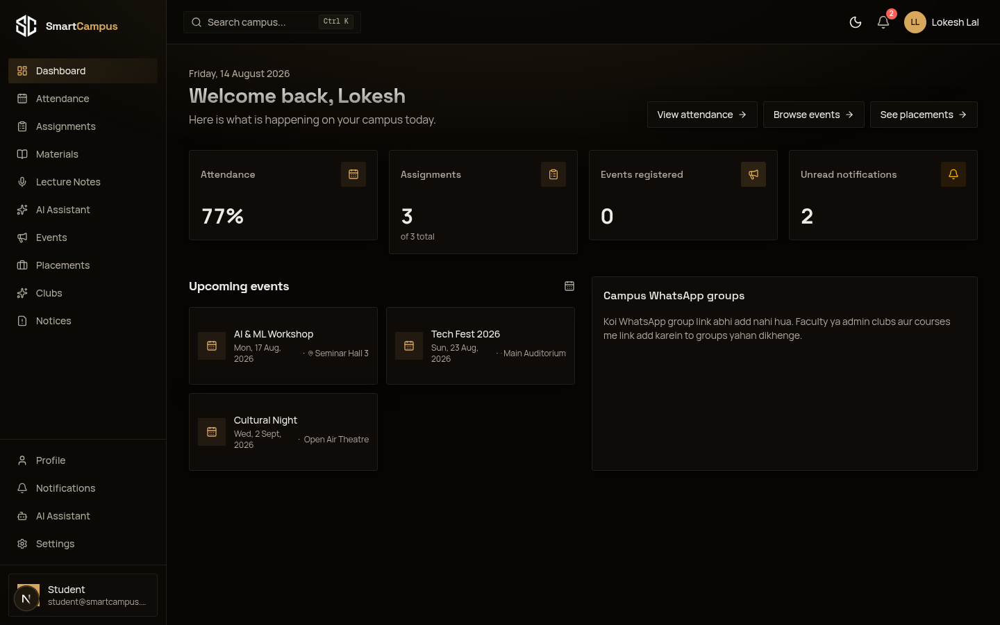
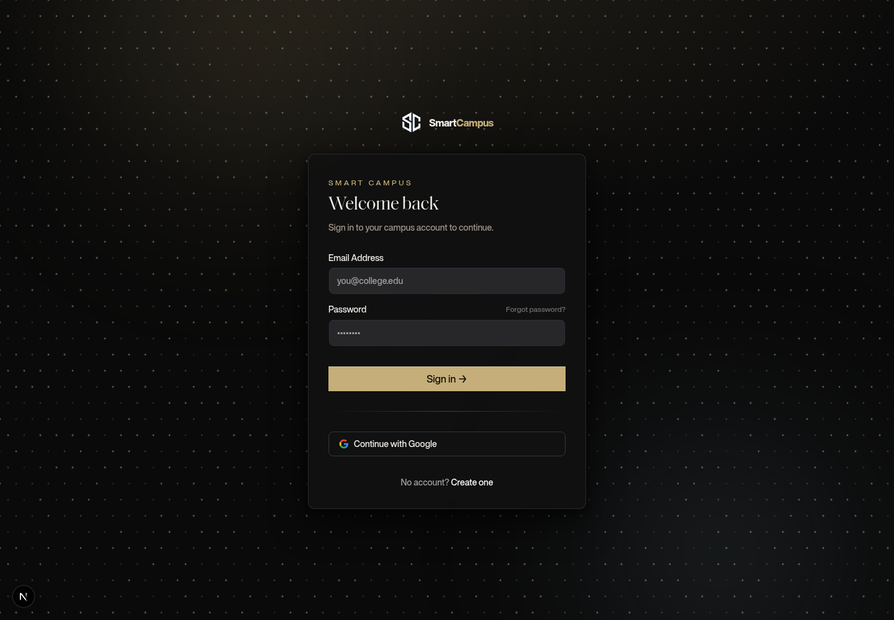
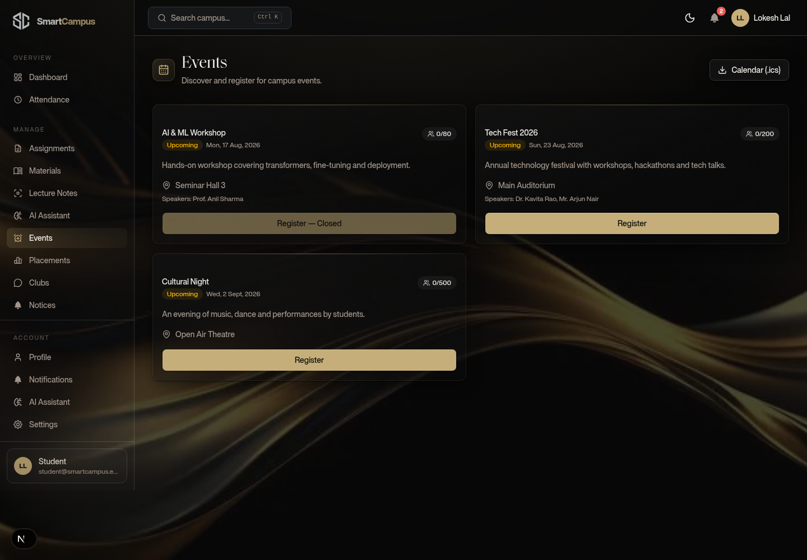
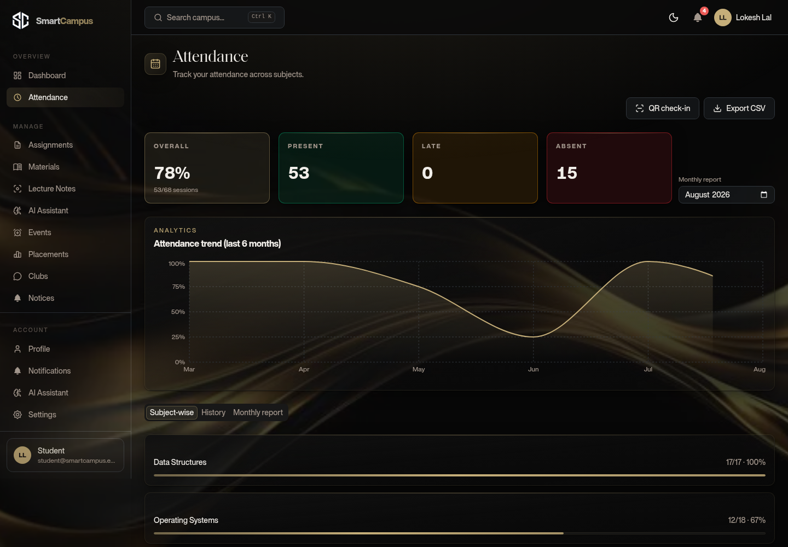
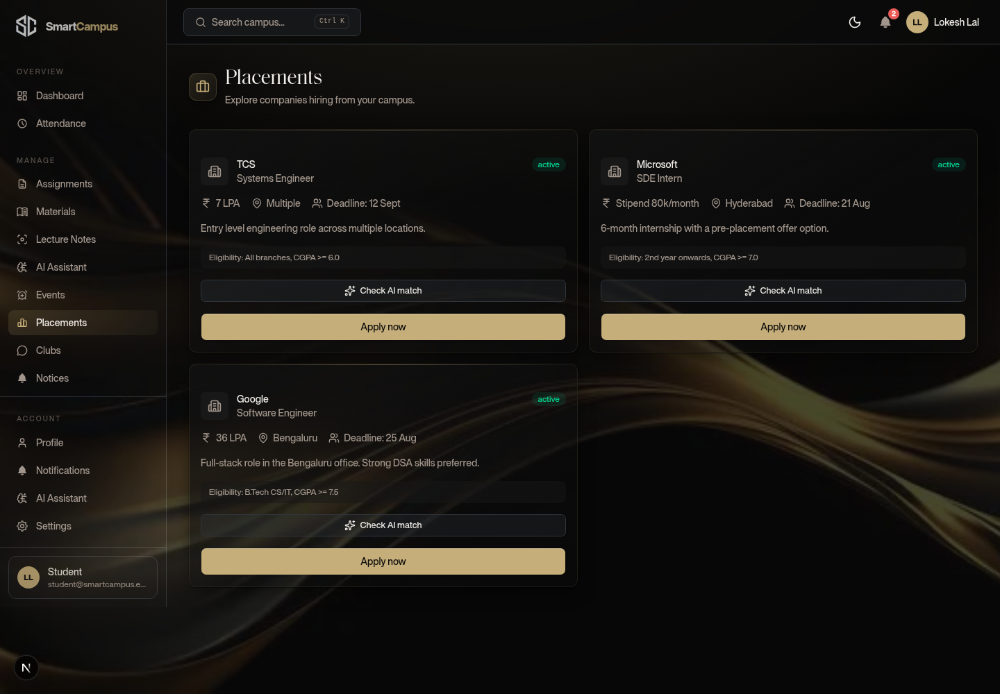
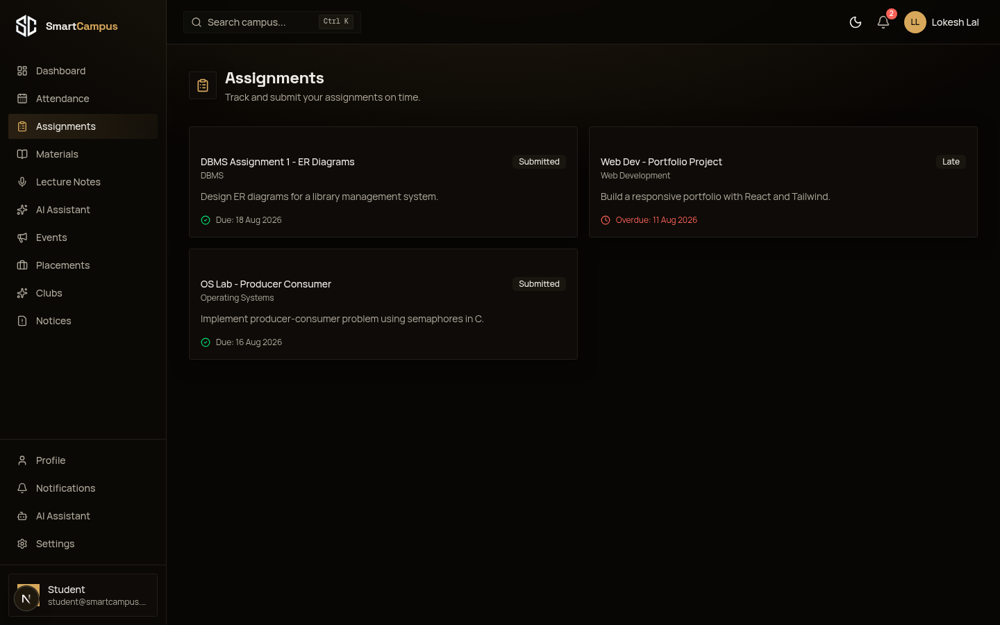

# Smart Campus Management Platform

Ek hi platform pe campus ki saari cheezein — attendance, assignments, events, placements, notifications. Students, faculty, coordinators aur admin ke liye alag dashboards.

Built for **DevFusion 4.0: The Developers Hackathon**.

## Live App

- **Live URL:** https://iit-bombay-hackathon-1r7i.vercel.app
- Auto-deploy on `main` push (Vercel, Mumbai region)

> **Auth status:** Email + password login & sign-up **tested & working** (OTP verification via
> dev-server log or SMTP). **Google Sign-in & Sign-up also working** (login page → Continue with
> Google → consent → dashboard; naya Google user auto-creates as student).

## Tech Stack

- **Frontend:** Next.js 16, React 19, Tailwind CSS, shadcn/ui, Framer Motion
- **Backend:** Next.js API routes, MongoDB (Mongoose)
- **Auth:** NextAuth v5 — Email + OTP, Google OAuth, JWT sessions
- **Extras:** QR event passes, email via SMTP, activity logs, dark/light mode

## Features

- Role-based dashboards (Student / Faculty / Coordinator / Admin)
- Attendance — faculty creates sessions, students get subject-wise analytics
- Assignments — upload with deadline + rubric, submit (file / GitHub link), grade with feedback
- Events — register, cancel, QR pass download
- Placements — company listings, apply with resume, application status
- Notifications — assignments, attendance, events, placements, alerts
- Global search + analytics charts
- Admin panel — user management, roles, activity logs

## Screenshots





| Login | Events |
| ----- | ------ |
|  |  |

| Attendance | Placements | Assignments |
| ---------- | ---------- | ----------- |
|  |  |  |

## Quick Start

Pehle kuch cheezein chahiye:

- Node.js 18.18+ (20+ recommended)
- MongoDB — local ya [MongoDB Atlas](https://www.mongodb.com/atlas) (free tier kaafi hai)

```bash
# 1. Repo clone karo
git clone https://github.com/AnonymousCoderArtist/IIT-Bombay-Hackathon.git
cd IIT-Bombay-Hackathon

# 2. Dependencies install karo
npm install

# 3. Environment setup
cp .env.example .env
# .env mein MONGODB_URI daalo (aur AUTH_SECRET - `openssl rand -base64 32` se bana sakte ho)

# 4. Database seed karo (sample data + test users)
npm run seed

# 5. Dev server chalayo
npm run dev
```

[http://localhost:3000](http://localhost:3000) pe kholo.

### AI features (optional — chatbot, lecture notes)

Python AI service (`services/ai/`) se RAG chatbot, lecture summarization, placement
match aur sentiment analysis chalti hain. Service nahi chalayi toh bhi app chalti hai
(mock fallback), bas AI responses mock honge.

```bash
# 1. Python service setup (pehli baar)
cd services/ai
python3 -m venv .venv
.venv/bin/pip install -r requirements.txt
cp .env.example .env   # AI_PROVIDER + free API key daalo

# 2. Service chalayo (port 8000)
.venv/bin/uvicorn app.main:app --port 8000

# 3. Root .env me link karo
# AI_SERVICE_URL=http://localhost:8000
```

Free LLM keys:
- **Gemini** — `AI_PROVIDER=gemini` + `GEMINI_API_KEY` ([aistudio.google.com/apikey](https://aistudio.google.com/apikey))
- **DeepSeek** — `AI_PROVIDER=deepseek` + `DEEPSEEK_API_KEY`

> AI service ke saare endpoints Swagger pe: `http://localhost:8000/docs`

## Test Credentials

| Role | Email | Password |
| ---- | ----- | -------- |
| Admin | `admin@smartcampus.edu` | `Admin@123` |
| Coordinator | `coordinator@smartcampus.edu` | `Coord@123` |
| Faculty | `faculty@smartcampus.edu` | `Faculty@123` |
| Student | `student@smartcampus.edu` | `Student@123` |

## Testing Guide

> **Full detailed step-by-step guide har feature ke liye:** [`docs/TESTING.md`](docs/TESTING.md)

### Step 1 — Setup

```bash
# 1. MongoDB start karo — Docker/atlas ki zaroorat nahi (local mongod)
npm run mongo:start      # ~/data/mongodb mein data store hoga, background mein chalega
# (aise check karo: mongosh --eval "db.runCommand({ping:1})"  →  { ok: 1 })
# (band karna ho toh: npm run mongo:stop)

# 2. Dependencies + env
npm install
cp .env.example .env
# .env mein AUTH_SECRET daalo:  openssl rand -base64 32

# 3. Sample data daalo (4 test users + departments + events + assignments etc.)
npm run seed

# 4. Dev server
npm run dev
```

[http://localhost:3000](http://localhost:3000) pe kholo.

### Step 2 — Automated checks

```bash
# Typecheck + lint (fast, har baar chalao)
npm run check

# API sanity check (dev server ON hona chahiye)
npm run test
# Output: "Sab theek hai. App ready hai!" — matlab health, DB aur saare APIs responding hain
```

### Step 3 — Manual testing (demo flow)

Har role ke saath login karke is flow pe chalo. Ek tab mein app, ek tab mein API route check kar sakte ho.

**Login flow:**
1. Register page pe jao, `name + email + password` se sign up karo (OTP aayega)
2. OTP kaise milega? `.env` mein SMTP nahi hai toh email send nahi hoti — **dev server ke terminal log mein `[mail:...]` wali line mein OTP dikhta hai**. Wahi 6-digit code daalo. (10 min valid)
3. Verify ke baad login karo

**Student (`student@smartcampus.edu` / `Student@123`):**
- Dashboard — attendance %, deadlines, upcoming events
- Attendance — apni subject-wise percentage dekho
- Assignments — list dekho, kisi pe submit karo (content ya GitHub link)
- Events — kisi event pe register karo → **QR pass milta hai** (download karo), phir cancel bhi karo
- Placements — listing dekho, apply karo, status track karo
- Clubs — kisi club mein join/leave karo
- Settings — theme dark/light karo, notification toggles on/off karo, **page refresh karke check karo sab save rehta hai**

**Faculty (`faculty@smartcampus.edu` / `Faculty@123`):**
- Attendance — naya session banao, students present/absent mark karo
- Assignments — assignment create karo (deadline + rubric ke saath), submissions dekho, grade + feedback do
- Notices — naya notice post karo

**Coordinator (`coordinator@smartcampus.edu` / `Coord@123`):**
- Events — naya event banao (date, venue, capacity ke saath)
- Placements — nayi company opening post karo (role, CTC, eligibility)
- Clubs — naya club banao

**Admin (`admin@smartcampus.edu` / `Admin@123`):**
- Dashboard — pura analytics (students, events, submissions sab)
- Users — list dekho, role/status change karo, delete karo
- Activity Logs — saari activity dekh sakte ho

**Cross-cutting checks (kisi bhi role se):**
- 🔍 Top search bar — "AI", "hackathon", "club" type karke global search test karo
- 🔔 Notifications — bell icon pe unread count, notifications page pe mark-as-read
- 📱 **Mobile** — browser devtools se phone view (360px) kholo, hamburger menu se sidebar khulna chahiye
- 🌙 Dark mode — topbar toggle + Settings dono se check karo
- Password change — Settings → Change Password (purana password + naya)
- Logout → phir se login

### Face Attendance testing (test card)

Face check-in `services/ai/` (UniFace + MiniFASNet liveness) se chalti hai. Local test flow:

```bash
# 1. AI service start karo (port 8000) — liveness test ke liye off (static photo allow)
cd services/ai
FACE_LIVENESS_DISABLED=1 .venv/bin/uvicorn app.main:app --port 8000
# (root .env me AI_SERVICE_URL=http://localhost:8000 hona chahiye)

# 2. Ek face enroll karo (student account pe) — script student id + aaj ka session + token print karta hai
npx tsx --env-file-if-exists=.env scripts/face-setup.ts
```

3. App me student login → `/attendance/scan` → **Face check-in** card me token paste karo
   (script joh print karega) → "Face se check-in karo" → photo upload karo ya camera capture.
4. `/attendance` pe jao → status `present` dikhega.

> Token 30 min valid. Expire ho jaye toh step 2 dobara chalao. Liveness normally ON hoti hai
> (printed/screen photo reject); test ke liye `FACE_LIVENESS_DISABLED=1` use karo.

### AI Assistant (normal chat + IIT Bombay context)

Assistant ek normal AI chatbot hai jo IIT Bombay ke context me baat karta hai — greetings aur
general chit-chat bhi karta hai, campus-specific cheez KB se grounded jawab deti hai (sources ke saath).
Mock mode me (AI service bina LLM key ke) general answers limited hain — **better answers ke liye
Settings → AI me apne AI credentials daalo** (Gemini/DeepSeek/OpenAI-compatible). Tab assistant
real LLM se chalti hai aur general + campus dono topics pe acchi jawab deti hai.

### Step 4 — API quick checks (curl)

```bash
# Health + DB
curl http://localhost:3000/api/health

# Public auth flow (nae email se)
curl -X POST http://localhost:3000/api/auth/register \
  -H "Content-Type: application/json" \
  -d '{"name":"Test User","email":"test@example.com","password":"Test@123","role":"student"}'

# Bina login ke protected route → 401 aana chahiye
curl http://localhost:3000/api/events            # → {"error":"Unauthorized"}

# Rate limit test (5+ baar same IP se register karo → 429)
for i in $(seq 1 6); do curl -s -o /dev/null -w "%{http_code} " \
  -X POST http://localhost:3000/api/auth/register \
  -H "Content-Type: application/json" \
  -d '{"name":"Spam","email":"spam@example.com","password":"Test@123","role":"student"}'; done
# Output: 201 201 201 201 201 429   ← 6th request rate-limited
```

### Step 5 — Demo recording tips

- 2-minute video ke liye: landing → register/verify → login (student) → dashboard → attendance → assignment submit → event register (QR) → placements apply → admin login → analytics + users → dark mode + mobile view
- Screen recorder ke saath `npm run dev` terminal dikhana mat bhoolo jahan OTP log hota hai (registration demo ke liye)

## PS-1 Coverage (DevFusion 4.0)

Problem Statement 1: **Smart Campus Management Platform** — production-ready, role-based campus
platform with auth, notifications, dashboards, analytics and responsive design.

**Mandatory Tech Stack:** React/Next.js ✓ · TypeScript ✓ · Tailwind CSS ✓ · Responsive UI ✓ · Node.js ✓ · Next.js API ✓ · MongoDB (Mongoose) ✓ · Email auth ✓ · Google OAuth ✓ · JWT/session auth ✓ · Vercel deployment ✓ · Docker (bonus) ✓

**Authentication:** Sign-up via email+password ✓ · Sign-up via Google ✓ · Login via email ✓ · Login via Google ✓ · Forgot password (OTP + email verification) ✓ · Email verification before dashboard access ✓ · Secure session management (JWT in cookies) ✓ · Secure logout ✓ · Protected routes (dashboard/settings/profile/events/attendance) ✓

**User Roles (4):** Student ✓ · Faculty ✓ · Coordinator ✓ · Admin ✓ — PS ke role-wise permissions implemented.

**Modules:** Student portal ✓ · Faculty portal ✓ · Event management ✓ · Attendance ✓ · Placement notices ✓ · Club activities ✓ · Assignment submission ✓ · Announcements/notices ✓ · Notifications ✓ · Admin controls ✓

**Landing Page:** Hero ✓ · Features ✓ · Testimonials ✓ · Statistics ✓ · FAQ ✓ · Footer ✓ · Responsive navigation ✓ · Dark mode ✓ · Animations ✓ · Loading screens ✓ · SEO ✓

**Dashboards:** every role gets a separate dashboard (student — attendance %, deadlines, events; faculty — classes, attendance, submissions; coordinator — events/placements/clubs; admin — full analytics + logs) ✓

**Student Profile:** picture, name, email, phone, roll number, department, semester, skills, LinkedIn, GitHub, resume upload, bio ✓

**Attendance:** faculty creates session + marks ✓ · student views %, history, subject-wise analytics, monthly reports ✓

**Assignments:** faculty uploads (deadline, attachments, rubric) ✓ · student submits (file/PDF/ZIP/GitHub link), submission history, late status ✓ · faculty review + marks + feedback ✓

**Events:** create (banner, description, venue, registration deadline, seats, speakers) ✓ · QR pass ✓ · student register/cancel + view ticket ✓

**Placements:** companies, roles, eligibility, CTC, deadline ✓ · apply button + application status + resume upload ✓

**Notifications:** real-time — assignment due, attendance marked, event reminder, placement open, system alerts ✓

**Global Search:** students, faculty, events, assignments, placements ✓

**Analytics charts:** monthly attendance, department performance, assignment completion, placement statistics, event participation ✓

**Admin Panel:** users, departments, courses, events, assignments, attendance, announcements, reports, logs, permissions ✓

**Settings:** profile, password, theme, notification preferences, connected accounts, delete account ✓

**UI/UX:** responsive design · dark/light mode · loading skeletons · empty states · error pages · toast notifications · beautiful forms · smooth animations · mobile friendly · accessibility (keyboard nav, contrast, semantic HTML) ✓

**Security:** bcrypt password hashing ✓ · input validation ✓ · rate limiting ✓ · XSS protection ✓ · secure cookies ✓ · environment variables ✓ · file upload validation ✓ · authorization middleware ✓ · server-side validation ✓ · audit logging for sensitive admin actions ✓

**Database entities (13/13):** Users ✓ · Roles ✓ · Departments ✓ · Attendance ✓ · Assignments ✓ · Assignment Submissions ✓ · Events ✓ · Event Registrations ✓ · Notifications ✓ · Placements ✓ · Applications ✓ · Settings ✓ · Activity Logs ✓

**Bonus features implemented:** AI chatbot for campus FAQs ✓ · QR attendance scanner ✓ · Face recognition attendance ✓ · Admin audit logs ✓ · API docs (AI service Swagger/OpenAPI) ✓ · Dockerized deployment ✓ · CI/CD (Vercel auto-deploy) ✓

**Bonus features not implemented:** live chat, calendar sync, PWA/offline, multi-language, AI plagiarism detection, email reminders, push notifications, WebSockets live updates, CSV/Excel export.

## Pending

- [ ] AI ke liye free LLM key daalna (Gemini/DeepSeek) taaki chatbot + lecture notes real AI se chalein (mock se nahi).
- [ ] Demo video (3–5 min)

## Deploy on Vercel

**Live:** https://iit-bombay-hackathon-1r7i.vercel.app

`vercel.json` already present hai (Mumbai region `bom1`, Next.js auto-detect, `main` pe auto-deploy).

1. Repo ko GitHub pe push karo → [Vercel](https://vercel.com/new) pe "Import Project" → repo select karo
2. Build auto-detect ho jayega (`npm run build`)
3. **Project Settings → Environment Variables** me ye daalo (`.env` wale hi hain, same values):

   | Variable | Value | Note |
   | -------- | ----- | ---- |
   | `MONGODB_URI` | Atlas SRV string | `<db_password>` ko apna Atlas password se replace karo (localhost Vercel pe nahi chalega) |
   | `AUTH_SECRET` | `openssl rand -base64 32` se | har deploy ke liye unique |
   | `AUTH_TRUST_HOST` | `true` | Vercel pe zaroori |
   | `AUTH_URL` | **khali chhodo** | Vercel trustHost se khud set karta hai |
   | `GOOGLE_CLIENT_ID` | `.env` wala | same |
   | `GOOGLE_CLIENT_SECRET` | `.env` wala | same |
   | `AI_SERVICE_URL` | khali (mock) ya alag host | Python AI service alag deploy karke URL do |
   | `SMTP_HOST` / `SMTP_PORT` / `SMTP_USER` / `SMTP_PASS` / `SMTP_FROM` | optional | emails ke liye |
   | `GEMINI_API_KEY` + `AI_PROVIDER=gemini` | optional | real AI chatbot ke liye |

4. Deploy hone ke baad Google Cloud Console me redirect URI add karo:
   `https://<vercel-domain>/api/auth/callback/google`
5. Python AI service ko [Render](https://render.com) ya Railway pe free deploy karke `AI_SERVICE_URL` set karo
   (nahi to app mock mode me chalti hai — AI features limited).

> Note: Vercel ke serverless filesystem pe files save nahi hoti, isliye resume/attachment upload ke liye
> Cloudinary ya Vercel Blob jaise service use karni padti hai. Python AI service alag service hai
> (AI_SERVICE_URL se connect). Vercel env process me inject karta hai, toh `.env` auto-load na hone ka
> issue nahi aata.

## Environment Variables

`MONGODB_URI`, `AUTH_SECRET`, Google OAuth credentials aur SMTP details — full list `.env.example` mein hai.
Credential placement guide (kaha kya update karna hai) — [`docs/CREDENTIALS.md`](docs/CREDENTIALS.md).

## Deliverables (PS-1 Expected Deliverables)

| PS-1 Expected Deliverable | Status | Where |
| ------------------------- | ------ | ----- |
| Source code (GitHub) | ✅ | [github.com/AnonymousCoderArtist/IIT-Bombay-Hackathon](https://github.com/AnonymousCoderArtist/IIT-Bombay-Hackathon) |
| Live deployed application | ✅ | [https://iit-bombay-hackathon-1r7i.vercel.app](https://iit-bombay-hackathon-1r7i.vercel.app) |
| README with setup instructions | ✅ | yehi file |
| API documentation | ✅ | [`docs/API.md`](docs/API.md) + AI service Swagger (`http://localhost:8000/docs`) |
| Database schema / ER diagram | ✅ | [`docs/ERD.md`](docs/ERD.md) + `src/lib/models/` |
| Architecture diagram | ✅ | [`docs/ARCHITECTURE.md`](docs/ARCHITECTURE.md) |
| Test credentials | ✅ | [Test Credentials](#test-credentials) section |
| Environment variable template | ✅ | `.env.example` |
| License file | ✅ | [MIT](LICENSE) |
| Demo video (3–5 min) | ⏳ pending | — |

Full feature test guide: [`docs/TESTING.md`](docs/TESTING.md)

## License

MIT
