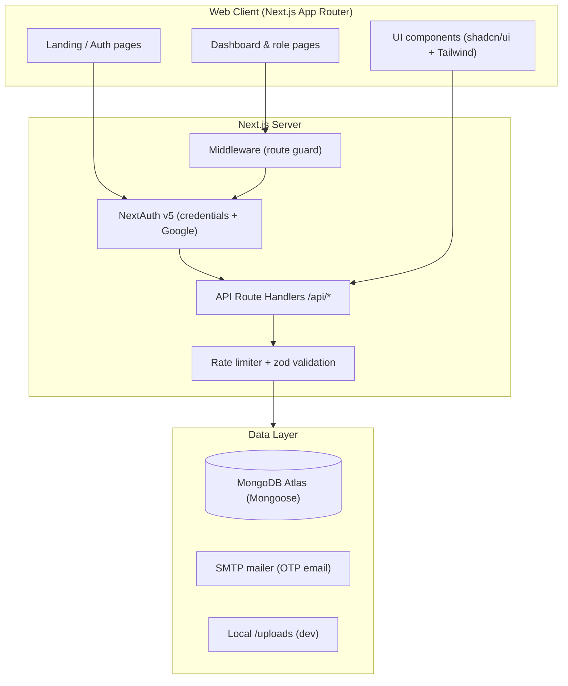

# Smart Campus — Architecture



## Stack

| Layer | Choice |
|---|---|
| Framework | Next.js 15 (App Router), React, TypeScript |
| Auth | NextAuth v5 — credentials + Google, bcrypt password hashing |
| Database | MongoDB via Mongoose (16+ collections) |
| Validation | zod on every mutating endpoint |
| Styling | Tailwind CSS + shadcn/ui components |
| Animation | framer-motion (landing page) |
| Email | SMTP (Nodemailer) for OTP + notifications |
| QR | `qrcode` package — HMAC-signed event passes |

## Flow overview

1. **Auth:** Registration creates a `pending` user and emails a verification OTP.
   Verifying sets `emailVerified` and `status: active`, after which credentials
   login is allowed. Password reset uses a second OTP flow.
2. **Authorization:** Middleware gates dashboard routes on a session; every API
   route re-checks the session and applies role rules (e.g. only faculty/admin
   create sessions, only students register for events).
3. **Data access:** Route handlers call Mongoose models directly. Role-aware
   queries (e.g. analytics, assignments) shape the response per user.
4. **Security:** bcrypt (cost 12), rate limiting on all auth endpoints + login,
   signed QR payloads, and server-side zod validation on every mutation.

## Folder layout

```
src/
  app/
    (dashboard)/         # role-gated app pages
    api/                 # route handlers (one folder per endpoint)
    (auth)/              # login / register / verify / reset pages
  components/
    ui/                  # shadcn primitives
    dashboard/           # sidebar, topbar, command search
    landing/             # marketing page sections
  lib/
    models/              # mongoose schemas
    validators.ts        # zod schemas
    otp.ts               # OTP generation + sending
    mailer.ts            # SMTP transport
    api-helpers.ts       # rate limit, ip, logging helpers
    db.ts                # mongodb connection
  middleware.ts          # route protection
  auth.ts / auth.config.ts  # NextAuth setup
```
