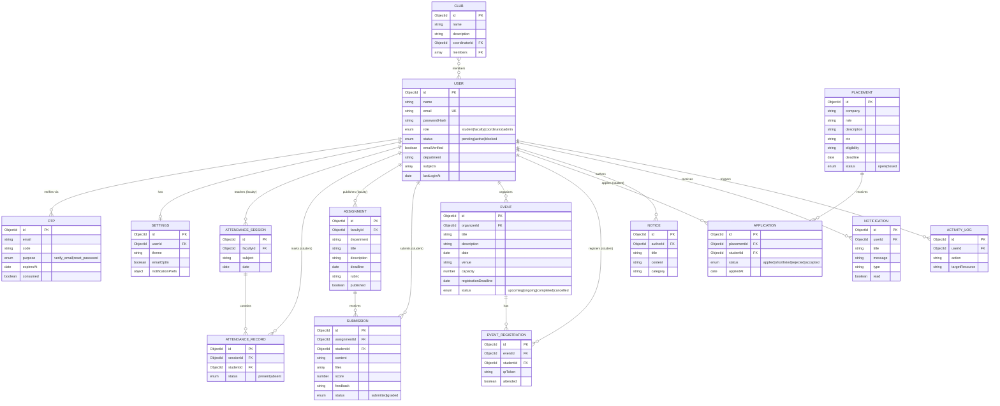

# Smart Campus — Entity Relationship Diagram

## Relationship notes

- A `User` maps to one of four roles; each role exposes a different subset of the system.
- `Settings` is a 1:1 extension of `User` (unique `userId`).
- `AttendanceSession` → `AttendanceRecord` is a 1:N (one session, many student records).
- `Assignment` → `Submission` is 1:N; a student can submit once per assignment.
- `Event` → `EventRegistration` is 1:N; registrations are unique per `(event, student)`.
- `Placement` → `Application` is 1:N; one application per `(placement, student)`.
- `Club.members` is an array of `User` refs (N:M).
